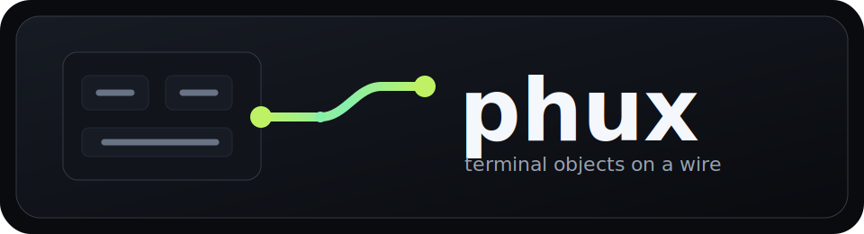
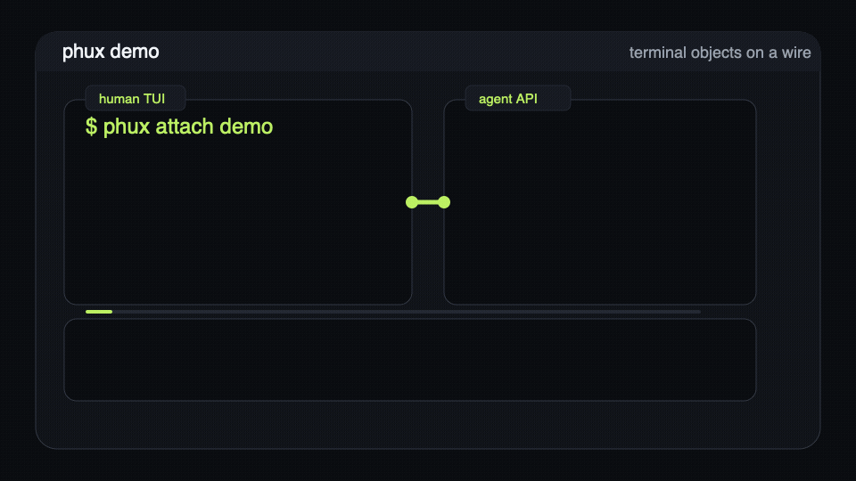

<!--
audience: humans, contributors, agents
stability: stable
last-reviewed: 2026-06-23
-->

<div align="center">



# phux

**the tmux job, done - a terminal is an object on a wire**

[](https://github.com/phall1/phux/actions/workflows/ci.yml)
[](#license)

[Start](#start-now) |
[Keys](#keys-you-need-first) |
[Config](#settings-and-config) |
[Headless](#headless-and-agent-control) |
[Status](#status) |
[Docs](#where-to-go-from-here)

</div>



phux is a terminal multiplexer: attach, split panes, detach, and come back
later to the same shells. The difference is underneath. In phux, a terminal is
a first-class object on a wire, so your TUI, a GUI, and an AI agent can all
hold the same live terminal instead of reading screenshots or copied text.

If you are new here, start with the commands below. You should be able to open
this page, run phux, find help, change config, split panes, detach, reattach,
and drive a pane from a script without hunting through the docs.

## Start now

Source is the install path guaranteed to work today:

```sh
git clone https://github.com/phall1/phux
cd phux
nix develop
cargo run --bin phux
```

That starts the server if needed and attaches a TUI client to the default
session. You are now inside a real shell running under phux.

## Keys you need first

Inside phux, the default prefix is `Ctrl-A`:

| You want to | Press |
|---|---|
| Open the help overlay | `Ctrl-A ?` |
| Open the command palette | `Ctrl-A :` |
| Split side by side | `Ctrl-A %` |
| Split stacked | `Ctrl-A "` |
| Move between panes | `Ctrl-A h/j/k/l` |
| New tab/window | `Ctrl-A c` |
| Switch tab/window | `Ctrl-A n` / `Ctrl-A p` or `Ctrl-A 0`-`9` |
| Window/session picker | `Ctrl-A w` / `Ctrl-A s` |
| Rename window/session | `Ctrl-A ,` / `Ctrl-A $` |
| Copy mode | `Ctrl-A [` |
| Detach | `Ctrl-A d` |

After detaching, the server and pane processes keep running. Reattach with:

```sh
cargo run --bin phux
```

Once you have an installed binary on your PATH, the same flow is just:

```sh
phux
```

## Settings and config

There is no settings modal. phux is config-file first: one TOML file overlays
the shipped defaults, and omitted keys keep following new defaults from the
binary.

If you are running from a source checkout before installing the binary, prefix
these commands with `cargo run --bin phux --`, for example
`cargo run --bin phux -- config path`.

| You want to | Run |
|---|---|
| See where config lives | `phux config path` |
| Create a commented starter config | `phux config init` |
| Print the effective merged config | `phux config show` |
| Print the shipped defaults with comments | `phux config show --default` |
| Validate configured plugins | `phux plugin validate` |
| Inspect plugins as JSON | `phux plugin list --json` |

Default config path:

```text
$XDG_CONFIG_HOME/phux/config.toml
# or, if XDG_CONFIG_HOME is unset:
~/.config/phux/config.toml
```

Edit the file, then restart the client to apply changes: detach and reattach,
or quit and run `phux` again. See [Configuration and keybindings](./docs/CONFIG.md)
for the schema, examples, status widgets, hooks, and plugin manifests.

## Install paths

phux is v0.0.x. Source is the only install path guaranteed to work today. Once
a post-`v0.0.1` release is cut, Homebrew becomes the primary binary install
path:

```sh
brew install phall1/phux/phux
```

The curl installer is a wrapper around GitHub release tarballs. It verifies the
release `.sha256` sidecar before unpacking and installs into
`${PHUX_INSTALL_DIR:-$HOME/.local/bin}`:

```sh
curl -fsSL https://raw.githubusercontent.com/phall1/phux/main/scripts/install.sh | bash
```

Today latest is `v0.0.1`, which is intentionally refused because it is not a
portable binary release. To install a specific future tag before it becomes
latest:

```sh
curl -fsSL https://raw.githubusercontent.com/phall1/phux/main/scripts/install.sh | bash -s -- --version v0.0.2
```

There is no `cargo install phux` yet. crates.io is scoped to
`phux-protocol`; the binary and internal crates are not publishable, and the
binary still depends on a git-pinned `libghostty-vt`. Off-Nix build details are
in [Install](./docs/INSTALL.md).

## Headless and agent control

Everything above also works without a TTY. The same terminals can be addressed
by name or id from scripts, CI, or an agent:

If you are still running from source, prefix these with
`cargo run --bin phux --` too.

```sh
phux ls --json                         # list sessions and panes
phux snapshot .                        # read the focused pane
phux send-keys . 'cargo test' Enter    # type into the focused pane
phux run . "cargo test"                # run in a real pane, return its exit code
phux wait . --until "0 failed"         # block until output appears
phux watch --json .                    # stream pane events
```

Selectors are shared across the CLI:

| Selector | Meaning |
|---|---|
| `.` | current focused pane/window/session |
| `work` | session named `work` |
| `work:1.0` | session `work`, window 1, pane 0 |
| `@42` | opaque server-local terminal id |
| `=` | last-focused target |

Point an MCP agent at `phux-mcp` and it gets the same core verbs over JSON-RPC
stdio. Start with [Agents](./docs/consumers/agents.md) and
[MCP](./docs/consumers/mcp.md).

## Why it is different

**Modern terminals stay modern across a reattach.** Kitty graphics, truecolor,
hyperlinks, OSC 133, and the modern keyboard protocol survive detach/reattach
because phux does not re-parse your bytes in the middle. The same terminal
engine ([libghostty][lghv]) runs on both ends of the wire.

**Agents are first-class users.** An AI agent can drive the same terminal you
are looking at, over the wire, with the same authority you have. There is no
separate "agent mode" to enter. There are terminals, and some attached users
are people while others are programs.

**The terminal is the unit.** Sessions, windows, panes, and splits are TUI
arrangements around terminals. A script or agent can spawn a terminal, route
input to it, read its output, and wait for state changes without learning the
whole human UI model.

For the longer mental model, read [Concepts](./docs/CONCEPTS.md). For fit and
tradeoffs, read [When to use phux](./docs/when-to-use.md).

## Status

The line between shipped and promised is kept explicit:

**Stable enough to try**

- TUI attach, detach, reattach, multi-pane splits, status bar, keybindings,
  help overlay, and multiple clients on one session
- Modern-protocol passthrough: Kitty keyboard, truecolor, OSC 8, OSC 133,
  images
- Version-negotiated wire types in `phux-protocol`

**Real and tested, still pre-1.0**

- Headless verbs: `ls`, `snapshot`, `send-keys`, `run`, `wait`, `watch`,
  `new`, `kill`, `rename`, `config`, `plugin`
- `phux-mcp`, exposing the same surface as MCP tools
- Config scaffolding and effective-config inspection

**Designed and addressed-for, not wired yet**

- Federation across machines. The wire already carries `SATELLITE { host, id }`;
  nothing routes it yet. That is the v0.2 arc.
- A native GUI consumer, a typed Rust SDK crate, predictive local echo.

Anything not in the first two lists is a direction, not a feature.

## Where to go from here

| You want to | Read |
|---|---|
| Run your first session | [Quickstart](./docs/QUICKSTART.md) |
| Install without Nix | [Install](./docs/INSTALL.md) |
| Customize keys and config | [Configuration](./docs/CONFIG.md) |
| Decide if phux fits | [When to use phux](./docs/when-to-use.md) |
| Understand the model | [Concepts](./docs/CONCEPTS.md) |
| Drive it from an agent | [Agents](./docs/consumers/agents.md) |
| Use the MCP adapter | [MCP](./docs/consumers/mcp.md) |
| Read the wire spec | [Spec](./docs/spec/) |
| See how it is built | [Architecture](./docs/architecture/) |
| Read where it is going | [Vision](./docs/vision.md) |
| See the decisions | [ADRs](./ADR/README.md) |
| Build it with us | [Contributing](./CONTRIBUTING.md) |

## Crates

| Crate | Does |
|---|---|
| `phux` | The binary: `attach` / `server` plus the headless verbs |
| `phux-protocol` | Wire types, codec, version negotiation; the crate meant for publishing |
| `phux-core` | Domain types: in-process terminal and collection registries |
| `phux-server` | The daemon: per-terminal actor, PTY supervision, output fanout |
| `phux-client-core` | Renderer and protocol client, ratatui-free |
| `phux-client` | The TUI chrome over `phux-client-core` |
| `phux-config` | TOML config schema and status widget contract |
| `phux-mcp` | The agent surface as MCP tools over JSON-RPC stdio |

## What phux deliberately will not do

Each of these is a "no" that keeps the model honest:

- **No embedded scripting language.** Commands are typed messages. Logic that
  wants a runtime can shell out to one.
- **No plugin host inside the server.** Plugins are manifests and argv commands;
  phux owns validation and routing, not your plugin runtime.
- **No tmux-style copy-mode clone as the core model.** Selection formatting
  belongs to libghostty and native selection belongs to your terminal. phux owns
  focused-pane navigation and literal search over scrollback.
- **No homegrown crypto.** SSH, Unix-socket permissions, and future transport
  authentication are the trust model.
- **No format-template DSL.** The status bar takes typed widgets, not a printf
  dialect.

Full reasoning: [Contributing](./CONTRIBUTING.md).

## License

Dual-licensed under [MIT](./LICENSE-MIT) or [Apache-2.0](./LICENSE-APACHE).

[lghv]: https://github.com/Uzaaft/libghostty-rs
